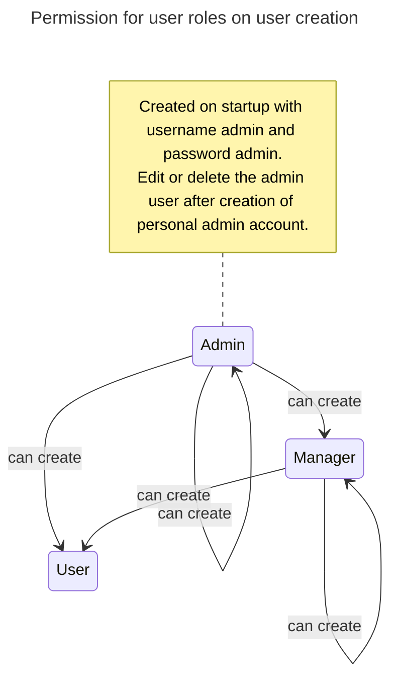
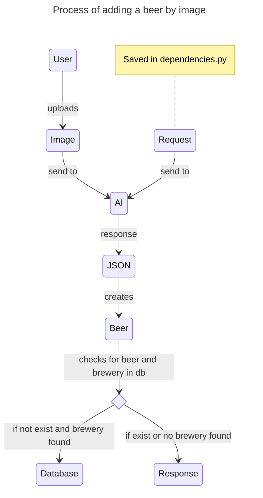

# DrinkManagerBackend
FastAPI Backend for the Drink-Manager-Webapp

This service is available on [DockerHub](https://hub.docker.com/r/fabiangnatzig/beerbackend).

You need three environment variables:
- DATABASE: Link to your local mysql database -> mysql+pymysql://{USER}:{PASSWORD}@{IP_ADDRESS}:{PORT}/{DATABASE_NAME}
    - Self hosted MySQL Database
- HASH_KEY: 32-bit like -> [FastAPI password hashing](https://fastapi.tiangolo.com/tutorial/security/oauth2-jwt/#handle-jwt-tokens⁠)
- OPEN_API_KEY: API-Key from your OpenAI account -> [OpenAI Platform](https://platform.openai.com/api-keys⁠)

On first startup, an admin user gets created. You can log in with admin / admin.

With an admin user, you can create user with roles admin, manager and user.
With a manager user, you can create user with roles manager and user.
With a normal user, you cannot create any user

You can create a beer by typing in its data or by uploading an image of the label.
How the image upload works is described below.

