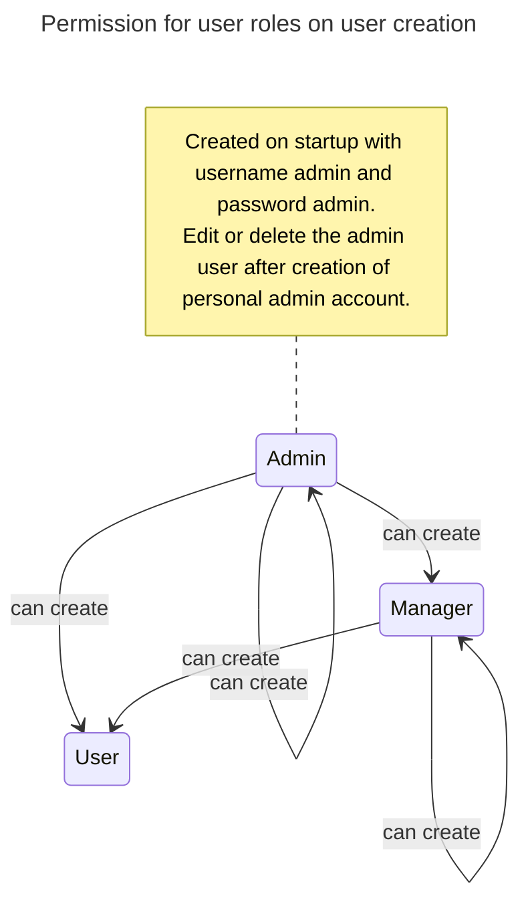
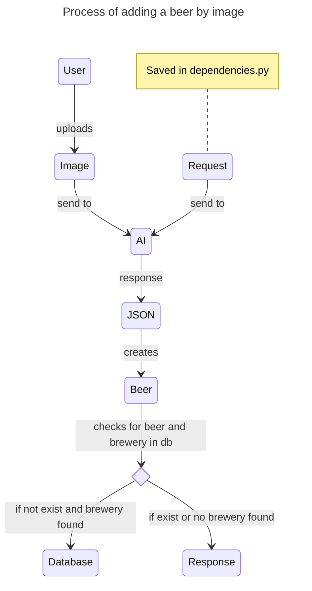

# DrinkManagerBackend
FastAPI Backend for the Drink-Manager-Webapp

This service is available on [DockerHub](https://hub.docker.com/r/fabiangnatzig/beerbackend).

## Installation

While creating the Docker container, you need three environment variables:
- DATABASE: Link to your local mysql database -> mysql+pymysql://{USER}:{PASSWORD}@{IP_ADDRESS}:{PORT}/{DATABASE_NAME}
    - Self-hosted MySQL Database
- HASH_KEY: 32-bit like -> [FastAPI password hashing](https://fastapi.tiangolo.com/tutorial/security/oauth2-jwt/#handle-jwt-tokens⁠)
- OPEN_API_KEY: API-Key from your OpenAI account -> [OpenAI Platform](https://platform.openai.com/api-keys⁠)

## Classes and routes

All classes have the following routes:
 - POST: `/'instance'/add`: adding a new instance
 - GET: `/'instance'/all`: showing all data of this instance
 - GET: `/'instance'/'id'`: showing an instance with id
 - DELETE: `/'instance'/'id'`: deleting an instance with id
 - PATCH: `/'instance'/'id'`: updating an instance with id

Some routes have some extra routes. **Documentation is following soon!**

### Brewery
A brewery instance gets created with a name, city and a country.
You need to connect a new kind of beer to an existing brewery.
```
{
    "name":     "example name",
    "city":     "example city",
    "country":  "example country"
}
```

### Beer
Beer is the drink instance. You can add a beer by inserting following data.

```
{
    "name": "example name",
    "beer_code": "cool beer code",
    "brewery_id": 1,  # link to brewery
    "alcohol": 0.5,   # with the %°
    "volume": 0.5
}
```
The "beer_code" is the number under the barcode.
In the future, it should be possible to search for a beer by just scanning the barcode.

### Team

A team instance is just a name with an ID.
Here you can create different seasons and events for managing your drinks on a timeline.

You can add a team by inserting following data.
```
{
    "name": "string"
}
```

### Season
A season is the main point for creating events.
With a team instance you can order all drinks by season and get funny statistic.

You can add a season by inserting following data.
```
{
    "name": "season name",
    "team_id": 1    # link to team
}
```

### Event
An event can be anything that you are doing with your team. A practice, game or party.
Anytime you will meet you team and want to drink something, it is an event.

You can add an event by inserting following data.
```
{
    "name": "event name",
    "season_id": 1,    # link to season
    "event_date": 2025-09-11 # Syntax is important!   
}
```

**_NOTE_**: The syntax the date has to be **YEAR-MONTH-DAY**!!! 

### UserBeer

A UserBeer is a special kind of management tool.
In my old team, you have to bring beer to the next event after your birthday.

You can add a personal note, why a user should bring the next drinks to your event.
```
{
    "kind": "funny kind like newspaper or birthday",
    "user_id": 1    # link to user
}
```

### BringBeer

A BringBeer is where the magic happens. Here you can connect a user with an event and a beer.
With his, you can connect and manage the drink for an event.

If the user has brought his beer successfully, you can set "done" == True.
If a user_beer is connected to a bring beer, the bring beer is not visible on the route "all_open_beer"
```
{
    "event_id": 1, # Link to an event
    "user_id": 1, # Link to an user
    "user_beer_id": 1, # Link to an userbeer if exist
    "beer_id": 1, # Link to an beer 
    "done": false # State if it is done or not.
}
```


## Standard admin user
On first startup, an admin user gets created. You can log in with admin / admin.

With an admin user, you can create user with roles admin, manager and user.
With a manager user, you can create user with roles manager and user.
With a normal user, you cannot create any user



## Features

### Add beer by an image

You can create a beer by typing in its data or by uploading an image of the label.
How the image upload works is described below.


### All open Beer
The route `/service/all_open_beer` will show all bring-beer instances that are not done.

### Beer amount
The route `/service/beer_ammount` will show an amount of how many drinks a user has brought.

### Check birthday
The check birthday route under `/service/check_brithday` will add an UserBeer if someone has birthday.

### Setup
The setup route under `/service/setup` will add a few breweries and beer for example data.
